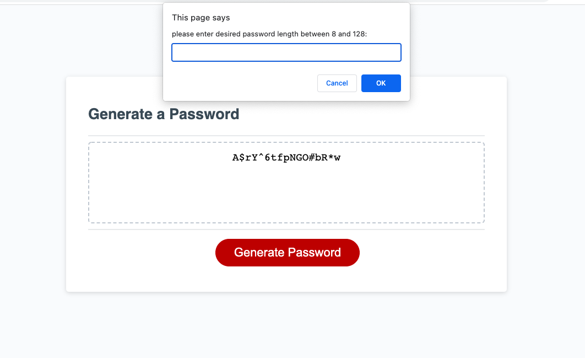

In this application, you will find a Password Generator.

Having a strong password is very important to keeping sensitive data and information secure. While this holds true for personal use, it is even more urgent for employers to maintain strict parameters in the workplace to protect their assets and knowledge. 

One method to beef up security through password protection is to require that all employees use a random password generator.

Each time an employee needs to change their password they can simply click the Generate Password button. This will begin a sequence of dialogue boxes that will either promt the user to enter a value, or to confirm the use of lower case letters, upper case letters, numbers, and special characters. This gives the employee some say in the customization of their password while still adhering to the company's policy on password parameters. If the user submits data that is outside these guidelines, they will be alerted and can begin the process again. When completed properly, the employee will be given a randomly selected new and secure password, which is displayed on the page.

To build this application, I was given starter HTML and CSS code as well as a few lines of JavaScript. I then worked to build out functions in JavaScript that would respond seamlessly through the user interface to allow the user to input thier personalized values and decisions. I wrote functions and made arguments to ensure that the user adhered to the parameters and always submitted info that was easily workable. This takes out all room for error and takes responsibilty off the user to follow a long series of very specific instructions.

No amount of luck will aid any hacker that tries to break into an account secured with a password derived from the Password Generator!

The attached screenshot shows the application at work. A previously derived password is displayed on the screen, while the user has just begun the generation sequence of a new password. 
